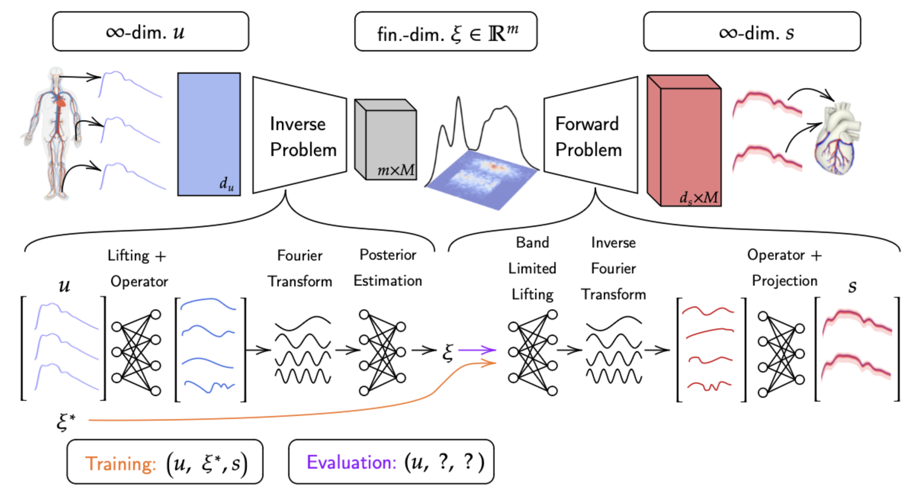

# FUSE
FUSE: Fast Unified Simulation and Estimation for PDEs

The paper is freely available [here](https://arxiv.org/pdf/2405.14558).

The joint prediction of continuous fields and statistical estimation of the underlying discrete parameters is a common problem for many physical systems, governed by PDEs. Until now, these two problems were often tackled separately. In this work, we show that by incorporating underlying discrete parameters into the prediction of continuous fields, it is possible to improve the accuracy and robustness of the neural operator. Moreover, it adds a level of *interpretability*, surpassing the blackbox paradigm of previous neural operator approaches and allowing for human understanding of complex systems. We present the capabilities of the proposed methodology for predicting continuous and discrete biomarkers in full-body haemodynamics simulations under different levels of missing information. We also consider a test case for atmospheric large-eddy simulation of a two-dimensional dry cold bubble, where we infer both continuous time-series and information about the systems conditions. We present comparisons against different baselines to showcase significantly increased accuracy in both the inverse and the surrogate tasks.

The goal of supervised operator learning is to learn a parameterized family of *neural operators* $$\tilde{\mathcal{G}}^{\theta}$$ by minimizing $$d (\tilde{\mathcal{G}}^{\theta}_{\# \mu^*}, \tilde{\mathcal{G}}_{\# \mu^*})$$, with $$d$$ being a suitable distance (metric) between the underlying pushforward measures. However, in practice, we do not have access to a closed form for $$\mu^*$$ but rather a small number of samples from it, so in reality, we end up minimizing $$d (\tilde{\mathcal{G}}^{\theta}_{\# \mu}, \tilde{\mathcal{G}}_{\# \mu^*})$$, where $$\mu$$ is an approximation of $$\mu^*$$, for instance obtained by finite sampling. 

As $$d$$ is a metric on measures, we use triangle inequality to observe that 
$
    d ( \tilde{\mathcal{G}}^{\theta}_{\# \mu}, \tilde{\mathcal{G}}_{\# \mu^*}) \leq \underbrace{ d ( \tilde{\mathcal{G}}^{\theta}_{\# \mu}, \tilde{\mathcal{G}}^{\theta}_{\# \mu^*})}_{\text{Measure matching}} +  \underbrace{d ( \tilde{\mathcal{G}}^{\theta}_{\# \mu^*}, \tilde{\mathcal{G}}_{\# \mu^*})}_{\text{Operator learning}}.
$
In other words, the operator learning objective can be split into two separate objectives. As we show in our work, these two separate objectives can be applied to learn inverse and forward problems using two distinct model components. Subsequently, we can \it{fuse} these two components together at inference time to emulate a forward problem, based on the posterior distributions of parameters obtained from solving the associated inverse problem. This leads the way to understanding uncertainties in infinite-dimensional spaces via their relationship with finite-dimensional parameters which are human-interpretable. 

