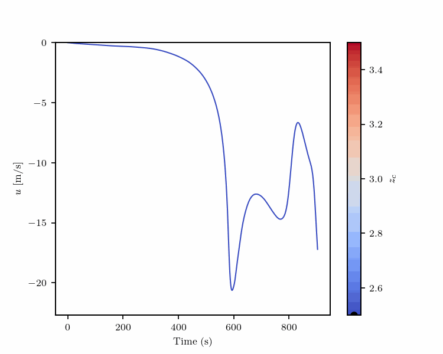
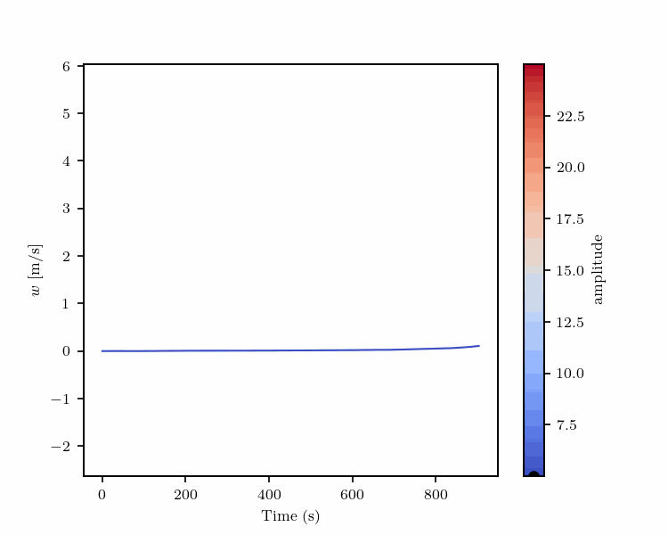

# FUSE: Fast Unified Simulation and Estimation for PDEs

Our preprint is freely available [here](https://arxiv.org/pdf/2405.14558).

The joint prediction of continuous fields and statistical estimation of the underlying discrete parameters is a common problem for many physical systems governed by PDEs. Until now, these two problems were often tackled separately, even in case the underlying parameterization is known. In this work, we show that by incorporating the discrete parameters into the prediction of continuous fields, it is possible to extend the neural operator probabilistically and represent the parametric system uncertainty. Moreover, it adds a level of *interpretability*, surpassing the black box paradigm of previous neural operator approaches and allowing for human understanding of complex systems. We present the capabilities of the proposed methodology for predicting continuous and discrete biomarkers in full-body haemodynamics simulations under different levels of missing information. In addition, we consider a test case for atmospheric large-eddy simulation of a two-dimensional dry cold bubble, where we infer both continuous time-series and information about the systems conditions. In order to showcase significantly increased accuracy in both the inverse and the surrogate tasks, the performance of FUSE is compared to several baseline models.

**Unifying Forward and Inverse Problems**

The goal of supervised operator learning is to learn a parameterized family of *neural operators* $`\tilde{\mathcal{G}}^{\theta}`$ by minimizing $`d(\tilde{\mathcal{G}}^{\theta}_{\#\mu^*},\tilde{\mathcal{G}}_{\#\mu^*})`$, with $d$ being a suitable distance (metric) between the underlying pushforward measures. However, in practice, we do not have access to a closed form for $`\mu^*`$ but rather a small number of samples from it, so in reality, we end up minimizing $`d (\tilde{\mathcal{G}}^{\theta}_{\# \mu}, \tilde{\mathcal{G}}_{\# \mu^*})`$, where $\mu$ is an approximation of $`\mu^*`$, for instance obtained by finite sampling. 

As $d$ is a metric on measures, we may use the triangle inequality to observe that 

$`d(\tilde{\mathcal{G}}^{\theta}_{\#\mu},\tilde{\mathcal{G}}_{\#\mu^*})\leq \underbrace{d(\tilde{\mathcal{G}}^{\theta}_{\#\mu},\tilde{\mathcal{G}}^{\theta}_{\#\mu^*})}_{\text{Measure matching}}+ \underbrace{d ( \tilde{\mathcal{G}}^{\theta}_{\# \mu^*}, \tilde{\mathcal{G}}_{\# \mu^*})}_{\text{Operator learning}}.`$

In other words, the operator learning objective can be split into two separate objectives. As we show in our work, these two separate objectives can be applied to learn inverse and forward problems using two distinct model components. Subsequently, we can *fuse* these two components together at inference time to emulate a forward problem, based on the posterior distributions of parameters obtained from solving the associated inverse problem. This leads the way to understanding uncertainties in infinite-dimensional spaces via their relationship with finite-dimensional parameters which are human-interpretable. 

**Network Structure, Training, and Evaluation**

The forward and inverse problems are each solved under the same principles. Each problem necessitates learning a relationship between a finite-dimensional and infinite-dimensional space. For the purpose of learning on infinite-dimensional spaces, neural operators are a clear choice, due to their discretization invariance. In this work, we choose to instantiate this operator learning component of our model with the *Fourier Neural Operator*, although any reasonably suitable neural operator would work. In order to bridge the gap between finite- and infinite-dimensional spaces, we rely on the space of band-limited functions. For this purpose, a constant set of low-frequency modes of a standard Fourier transform is used. The coefficients of the discrete Fourier transform are finite-dimensional scalars which each correspond to a function, offering a pathway to learn the relationship between finite-dimensional PDE parameters and their infinite-dimensional functions. In order to learn a probabilistic estimate of the inverse problem, we use a conditional generative model for inference. We find the best performance with *Flow Matching Posterior Estimation*, but we also investigate conditional denoising diffusion probabilistic models. In the case of the forward problem, we learn a deterministic lifting operator, increasing the dimensionality of the low-dimensional parameters to the represent the Fourier coefficients of band-limited functions, which will subsequently be passed to the neural operator. 

The training process for the forward and inverse problem is performed separately. Given access to continuous inputs $u$, continuous outputs $s$, and finite-dimensional system parameters $\xi$, the forward model is trained by minimizing an $L^1$ loss ($\mathcal{L}_1$) while the inverse model is trained by minimizing the flow matching objective ($\mathcal{L}_2$),

$`\mathcal{L}_1(\theta, \xi, s) =   \int_{\Xi} \| \mathcal{G}(\xi) - \mathcal{G}^{\theta}(\xi)\|_{L^1(\mathcal{Y})} d \rho^*(\xi),`$

$`\mathcal{L}_2(\phi, u, \xi) = \mathbb{E}_{t\sim p(t), \xi_1 \sim \rho^*(\xi | u), \hat{u} \sim p(\hat{u}|\xi_1), \xi_t \sim p_t(\xi_t| \xi_1)}||v^{\phi_1}_{t, \hat{u}}(\xi_t) - l_t(\xi_t|\xi_1)||_2^2.`$

For the sake of brevity, we refer the interested reader to the [paper](https://arxiv.org/pdf/2405.14558) for more details on these loss objectives.

At evaluation time, we can choose to evaluate both the forward and inverse problem, using the pushforward of the propagated uncertainty from the inverse problem to quantify the uncertainty in the continuous outputs, representing the *propagated uncertainty*. Alternatively, we can evaluate only the forward model if the systems parameters are known. Likewise, we can vary these parameters in order to explore their effect on the continuous outputs, a process known as *fingerprinting*.

**Results from the Atmospheric Cold Bubble Experiment**

The atmospheric cold bubble (ACB) experiment aims to learn the relationship between velocity measurements and the initial and system conditions. Velocities are measured at point locations, resembling measurements taken by turbulence towers. The initial condition of the ACB is parameterized by height $z_c$, vertical radius $z_r$, horizontal radius $x_r$, and amplitude of the temperature anomaly, and it is also affected by the sub-grid scale viscosity and diffusivity as model parameters of the large-eddy simulation. 

<table align="center">
  <tr>
    <td></td>
    <td></td>
    <td></td>
  </tr>
</table>

*The cold bubble test case:* Time evolution of velocities and the temperature anomaly. The triangles mark the measurement locations where the time series measurements $u$ (horizontal velocity) and $w$ (vertical velocity) are taken.

*Combined Forward and Inverse Problem:*
Given one set of continuous measurements $u$ from the testing dataset, the inverse problem is solved to uncover the posterior distribution of the parameters $\xi$. Samples are then passed through the forward model to calculate an ensemble of predictions for the velocity $s$ at a given location.

<table align="center">
  <tr>
    <td></td>
    <td></td>
  </tr>
  <tr>
    <td></td>
    <td></td>
  </tr>
</table>

*Fingerprinting:*
Sweeping through different parameters uncovers their effects on the continuous output functions. Since each parameter value requires a full model run, fingerprinting at this detail is not feasible with the full numerical model.

**Cite As**

Lingsch, L. E., D. Grund, S. Mishra, and G. Kissas (2024). *FUSE: Fast Unified Simulation and Estimation for PDEs*. doi: 10.48550/arXiv.2405.1455

> @misc{lingsch2024, \
>>  title = {{FUSE}: Fast Unified Simulation and Estimation for {PDEs}}, \
  	rights = {All rights reserved}, \
	  url = {http://arxiv.org/abs/2405.14558}, \
	  doi = {10.48550/arXiv.2405.14558}, \
  	shorttitle = {{FUSE}}, \
  	number = {{arXiv}:2405.14558}, \
  	publisher = {{arXiv}}, \
  	author = {Lingsch, Levi E. and Grund, Dana and Mishra, Siddhartha and Kissas, Georgios}, \
  	urldate = {2024-05-23}, \
  	date = {2024-05-23}, \
  	eprinttype = {arxiv}, \
  	eprint = {2405.14558 [cs]}, \
  	keywords = {Computer Science - Machine Learning}, \
}

